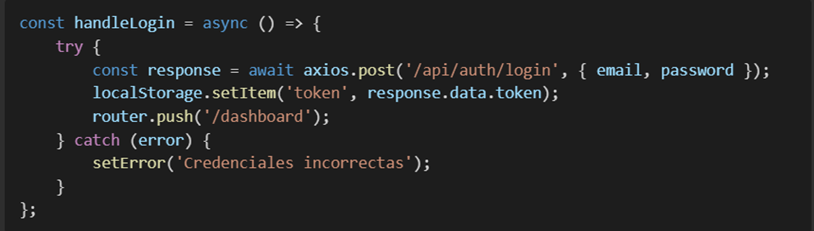

# Proyecto-DPS

Materia: Diseño y Programación de Software Multiplataforma DPS941 G01T

Docente: Ing. Alexander Alberto Siguenza CamposTrabajo de Investigación

👥 Integrantes

Carlos Adalberto Campos Hernandez - CH222748

Jose Valentin Corcios Segovia - CS232913

Ludwin Enrique Martinez Alfaro - MA222763

Fernando Samuel Quijada Arevalo - QA190088

# Funcionalidades Principales

## - Inicio de Sesión / Login Page

Se muestra la página principal donde se ingresará el usuario y contraseña.

Validación de credenciales correctas o incorrectas.

Imagen 1:

Imagen 2:

## - Panel de Administración

Una vez que el usuario inicie sesión como administrador, tendrá acceso a:

Agregar, editar y eliminar usuarios.

Mantenimiento del sistema.

Auditoría del sitio.

Revisar los proyectos agregados.

#### Vista general

#### Auditoría

#### Mantenimiento y Gestión de Proyectos

#### Creación de nuevos proyectos: 

En esta parte, se valida la entrada de las fechas, ya que la fecha de inicio del proyecto no puede ser menor a la actual, y la fecha de finalización no puede ser menor a la fecha de inicio. 

Una vez se validan las fechas, el proyecto es creado de manera exitosa.

## - Página de Inicio de Usuarios

Una vez este agregado dentro del sistema, un usuario podrá acceder mediante su usuario y contraseña, validado igualmente como la parte del administrador, para revisar las tareas que este tenga asignadas.

Una vez el usuario sea autenticado, podrá ver las tareas que tenga asignadas: 

En el panel de gestión de usuarios, este podrá ver las tareas asignadas, ver los comentarios de esa tarea y aumentar el porcentaje de avance de dicha tarea. 

# 📂 Estructura del Proyecto

El proyecto es una aplicación basada en Next.js, con una estructura bien definida que separa páginas, componentes y API.

## 1. Páginas Principales

#### index.js (Página de inicio)

* Implementa la lógica de inicio de sesión.
* Usa useState y useEffect para manejar el estado de autenticación.
* Envía credenciales a /api/auth/login usando axios.
* Guarda el token en localStorage y redirige al usuario según su rol (admin, gerente, miembro).
* Maneja errores en el inicio de sesión con mensajes dinámicos

#### login.js (Página de Login)

* Similar a index.js, pero con una interfaz enfocada en la autenticación. 
* Incluye validación de campos (correo y contraseña). 

## 2. Configuración Global

#### _app.js

* Importa estilos globales y Bootstrap.
* Configura react-query para la gestión de datos y almacenamiento en caché.
* Implementa un AuthProvider para manejar sesiones de usuario de manera global.

#### _document.js

* Personaliza la estructura HTML de Next.js.
* Agrega metadatos importantes como título y descripción para SEO.

## 3. Panel de Administración (/admin)

#### admin/auditoria.js

* Muestra actividades del sistema paginadas.
* Usa axios para obtener datos de /api/actividad.
* Permite exportar datos a Excel con xlsx.
* Incluye un filtro por fecha y tipo de actividad. 

#### admin/index.js

* Página principal del panel de administración.
* Muestra estadísticas generales del sistema.
* Acceso rápido a módulos clave (usuarios, proyectos, auditorías)

#### admin/mantenimiento.js

* Gestiona copias de seguridad y restauración.
* Interactúa con /api/mantenimiento/respaldo y /api/mantenimiento/restaurar.
* Permite descargar backups en formato SQL.

## 4. API (/api/)

#### api/auth/login.js

* Verifica credenciales y devuelve un token JWT.
* Hashea contraseñas con bcrypt.
* Maneja sesiones con jsonwebtoken.

## 5. Tecnologías Utilizadas

* Next.js como framework principal.
* JavaScript para la lógica del cliente y servidor.
* SQL (MySQL) para la base de datos.
* Vercel como posible plataforma de despliegue.
* Axios para la comunicación con la API.
* bcrypt y jsonwebtoken para seguridad y autenticación.
* React Query para el manejo eficiente de datos.
