# 🎓 Proyecto-DPS

**Materia:** Diseño y Programación de Software Multiplataforma — *DPS941 G01T*  
**Docente:** Ing. Alexander Alberto Sigüenza Campos

## 👥 Integrantes

- **Carlos Adalberto Campos Hernández** - CH222748  
- **José Valentín Corcios Segovia** - CS232913  
- **Ludwin Enrique Martínez Alfaro** - MA222763  
- **Fernando Samuel Quijada Arévalo** - QA190088  

---

## 🎥 Video de Presentación

> Mira la demostración del proyecto en el siguiente enlace:  

---

## 🚀 Funcionalidades Principales

### 🔐 Inicio de Sesión

- Página principal de login donde el usuario ingresa sus credenciales.
- Validación de credenciales correctas o incorrectas.

**Capturas:**

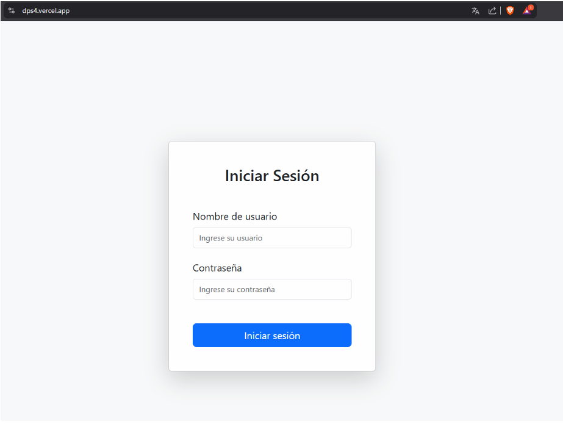
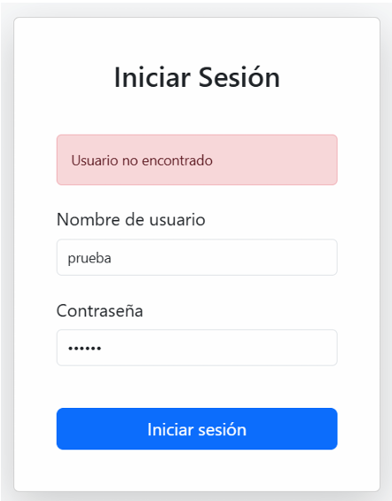

---

### 🛠️ Panel de Administración

Accesible únicamente para administradores, permite:

- Agregar, editar y eliminar usuarios.
- Mantenimiento del sistema.
- Auditoría del sitio.
- Revisión y gestión de proyectos.

**Capturas:**

- Vista general  
  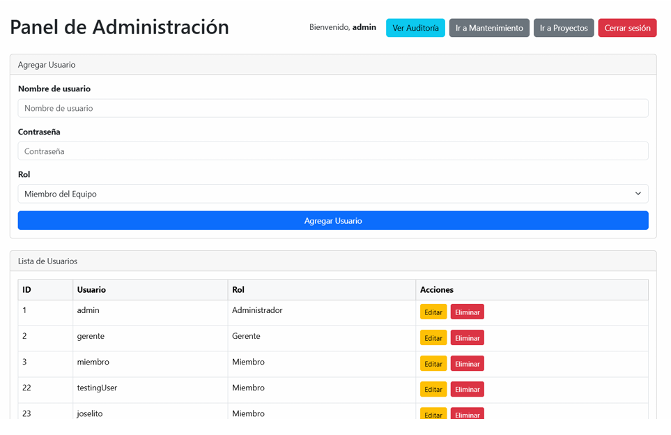

- Auditoría del sistema  
  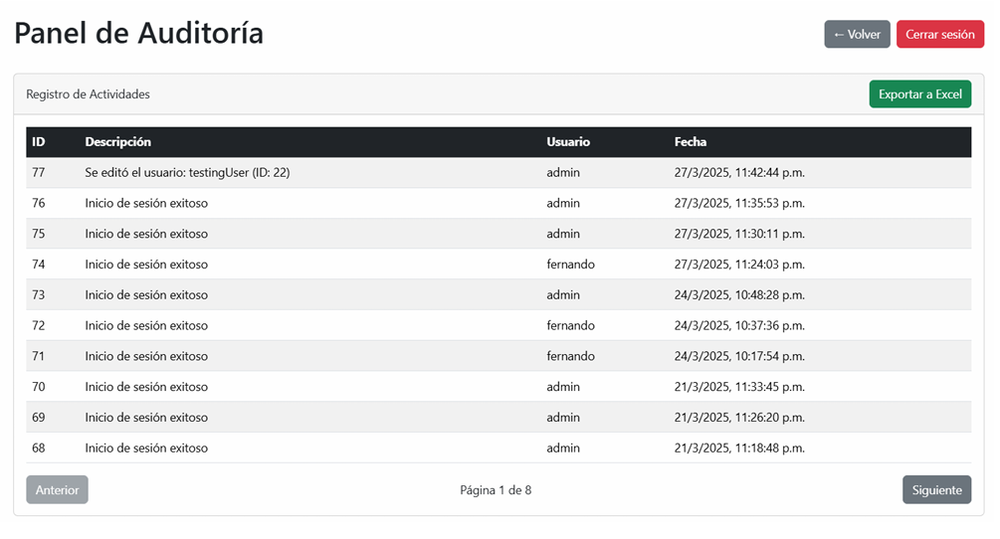

- Gestión de proyectos y mantenimiento  
  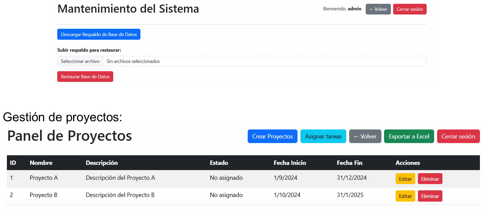

#### ✅ Validación en Creación de Proyectos

- Validación de fechas:  
  - La fecha de inicio no puede ser menor a la actual.  
  - La fecha de finalización no puede ser menor a la fecha de inicio.  

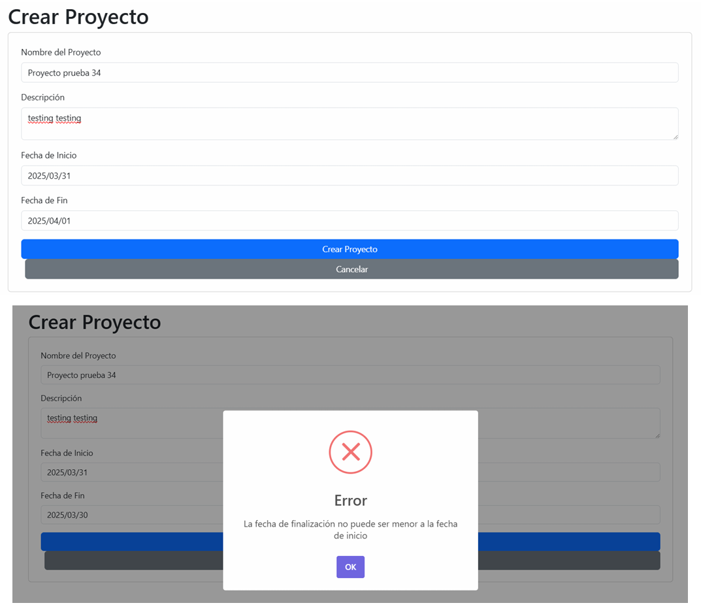  
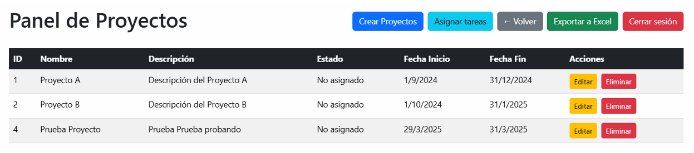

---

### 👤 Página de Inicio de Usuarios

Los usuarios autenticados pueden:

- Visualizar tareas asignadas.
- Ver comentarios en tareas.
- Actualizar el progreso de las mismas.

**Capturas:**

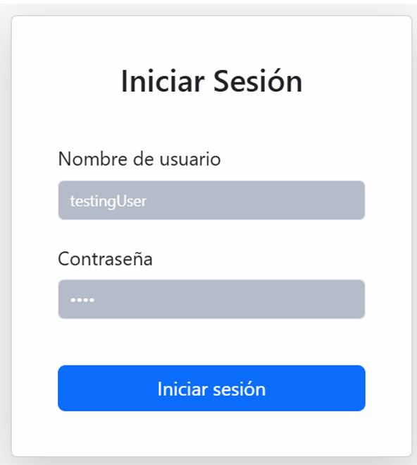  
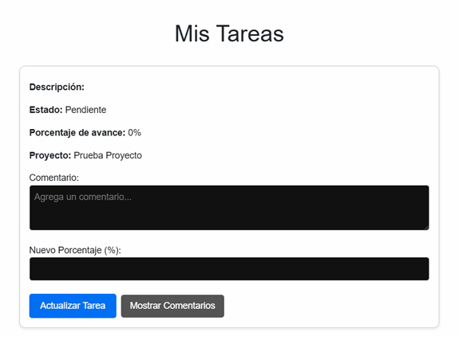  
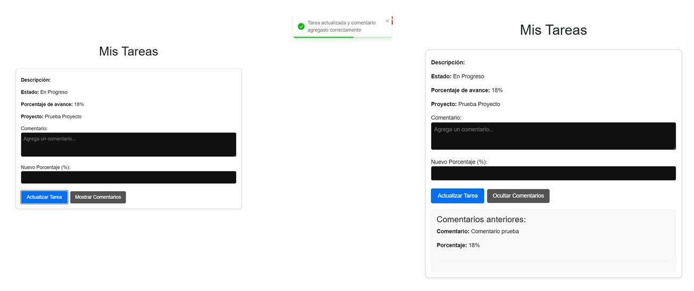

---

## 📂 Estructura del Proyecto

El proyecto está desarrollado con **Next.js**, con una arquitectura modular clara entre páginas, componentes y API.

### 📄 Páginas Principales

#### `index.js` (Inicio)

- Controla la lógica de autenticación.
- Envía credenciales a `/api/auth/login`.
- Guarda el token en `localStorage` y redirige según el rol.
- Manejo de errores con mensajes personalizados.

#### `login.js` (Login)

- Validación de campos (correo y contraseña).
- Enfoque directo en la autenticación.

### ⚙️ Configuración Global

#### `_app.js`

- Importación de estilos globales y Bootstrap.
- Configuración de `React Query`.
- Implementación del `AuthProvider`.

#### `_document.js`

- Personalización del documento HTML base.
- Inclusión de metadatos para SEO.

---

## 🛡️ Panel de Administración (`/admin`)

#### `admin/auditoria.js`

- Muestra actividades del sistema paginadas.
- Exportación a Excel con `xlsx`.
- Filtros por fecha y tipo de actividad.

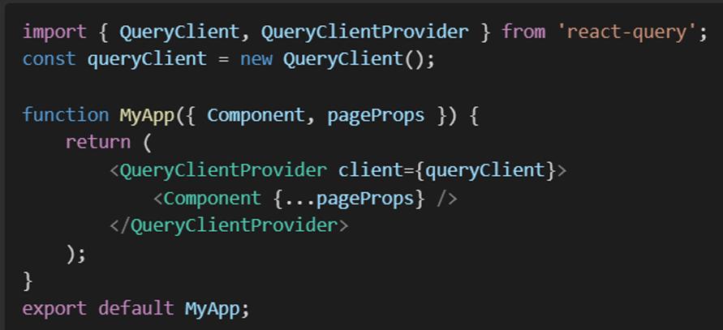

#### `admin/index.js`

- Página de inicio del panel.
- Estadísticas del sistema.
- Accesos rápidos a usuarios, proyectos y auditoría.

#### `admin/mantenimiento.js`

- Gestión de respaldos y restauración de base de datos.
- Descarga de respaldos en formato `.sql`.

---

## 🔌 API (`/api/`)

#### `api/auth/login.js`

- Validación de credenciales.
- Hasheo de contraseñas con `bcrypt`.
- Generación de token JWT para manejo de sesiones.

---

## 🧰 Tecnologías Utilizadas

- **Next.js** (framework principal)
- **JavaScript** (frontend y backend)
- **MySQL** (base de datos)
- **Vercel** (despliegue)
- **Axios** (peticiones HTTP)
- **bcrypt** y **jsonwebtoken** (autenticación)
- **React Query** (gestión de datos eficiente)
